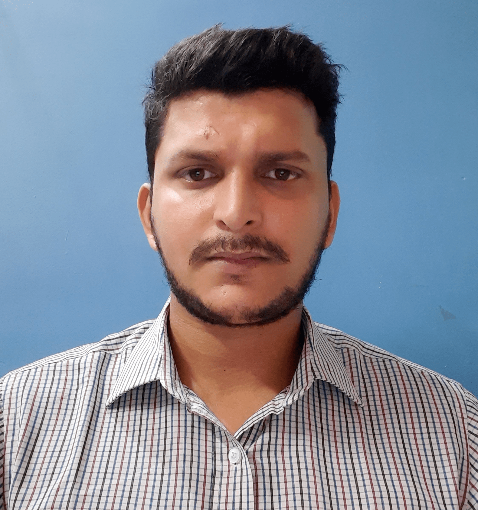

---
# Feel free to add content and custom Front Matter to this file.
# To modify the layout, see https://jekyllrb.com/docs/themes/#overriding-theme-defaults

layout: home
title: Home
page_title:
exclude: true
---

{::options parse_block_html="true" /}

{:.avatar}

**Hi, my name is Somnath Pathak and I'm a Senior Engineer with experience in full stack development of web apps.**

I get by as a back end & database developer, front end developer, UI designer, and motorcycle enthusiast living in Bangalore, India and working for a corporate organisation.

I'm also available for hire as a freelance web developer, designer, or consultant. Drop me a line about your project if you're interested in working with me.

{::options parse_block_html="false" /}